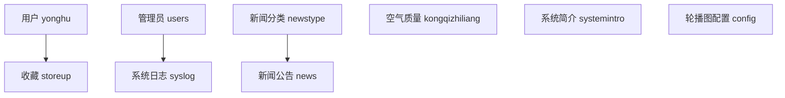
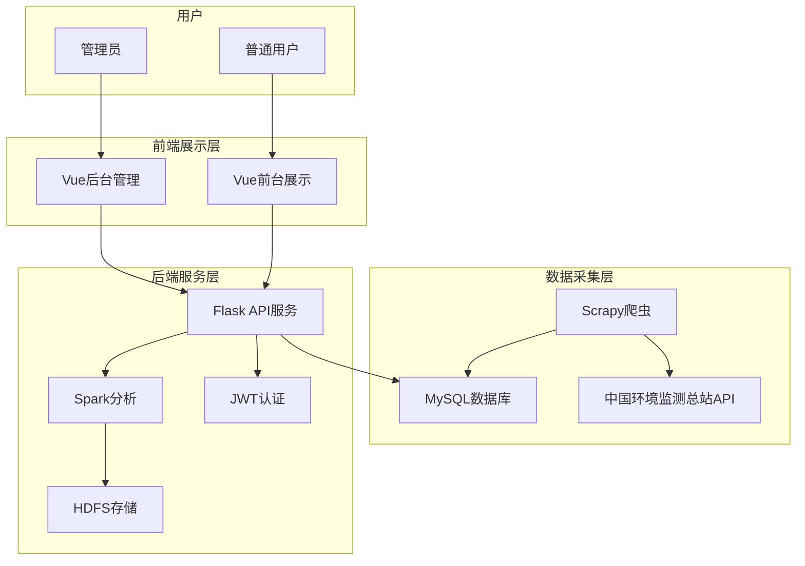
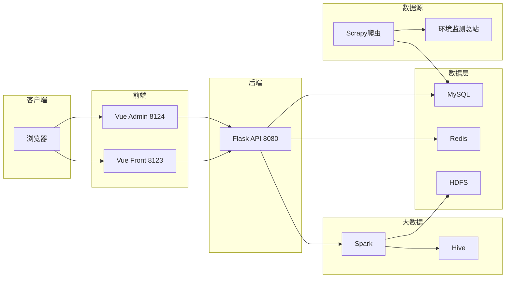
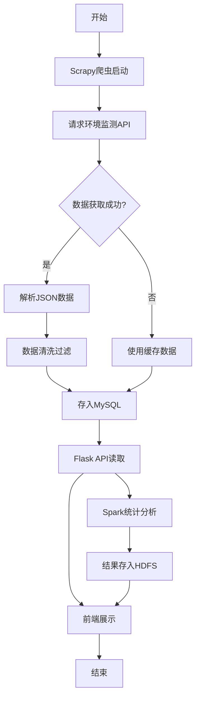
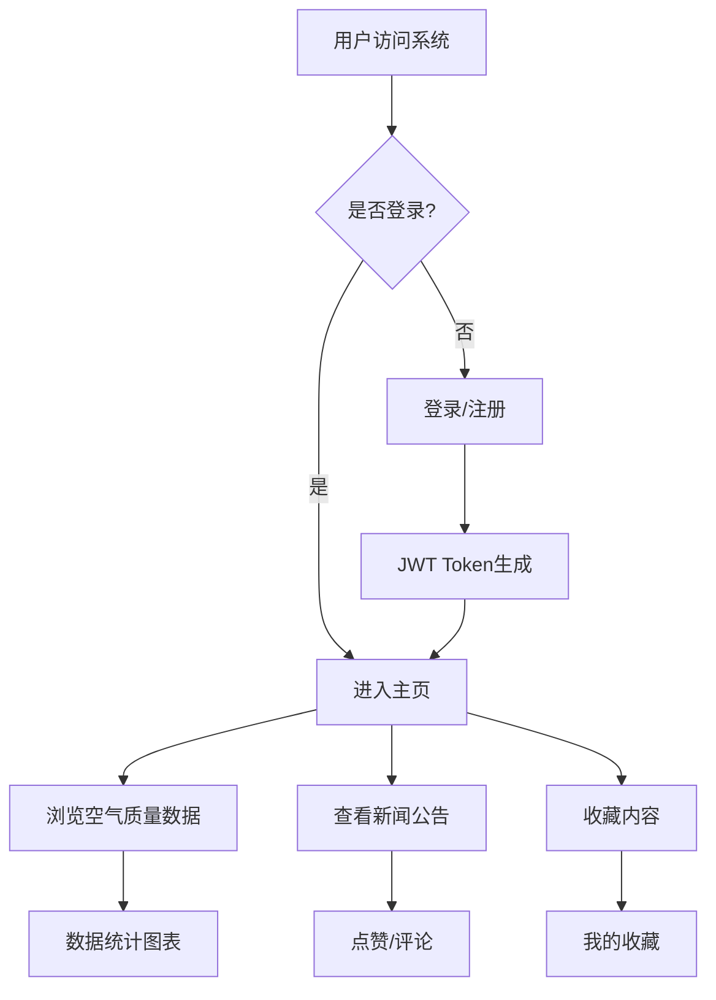

# 空气质量监测与管理系统

## 项目概述

本项目是一个基于 Python Flask + Vue.js 的空气质量监测与管理系统，集成了 Scrapy 爬虫用于数据采集，支持 Spark/Hive/HDFS 大数据处理能力。系统从中国环境监测总站实时获取空气质量数据，并提供数据可视化、统计分析等功能。

---

## 技术栈

| 层级 | 技术 |
|------|------|
| 后端框架 | Flask 1.1.2 + Flask-SQLAlchemy |
| 前端框架 | Vue.js 2.x |
| 数据库 | MySQL 5.7+ |
| 爬虫框架 | Scrapy 2.6.3 |
| 大数据组件 | PySpark 3.3.2 / PyHive / HDFS |
| 认证方式 | JWT Token |

---

## 项目结构

```
air/
├── python_air/                      # Python 后端项目
│   ├── api/                         # API 模块
│   │   ├── main/                    # 视图层（路由接口）
│   │   │   ├── Kongqizhiliang_v.py  # 空气质量接口
│   │   │   ├── Yonghu_v.py          # 用户管理接口
│   │   │   ├── News_v.py            # 新闻公告接口
│   │   │   ├── Newstype_v.py        # 新闻分类接口
│   │   │   ├── Storeup_v.py         # 收藏功能接口
│   │   │   ├── Syslog_v.py          # 系统日志接口
│   │   │   ├── Systemintro_v.py     # 系统简介接口
│   │   │   ├── config_v.py          # 配置管理接口
│   │   │   ├── users_v.py           # 管理员用户接口
│   │   │   └── common.py            # 通用接口
│   │   ├── models/                  # 数据模型层
│   │   │   ├── brush_model.py       # 业务数据模型
│   │   │   ├── models.py            # 基础模型类
│   │   │   ├── user_model.py        # 用户模型
│   │   │   └── config_model.py      # 配置模型
│   │   ├── templates/front/         # 前端项目
│   │   │   ├── admin/               # 后台管理系统（Vue）
│   │   │   └── front/               # 前台展示系统（Vue）
│   │   └── exts.py                  # Flask 扩展初始化
│   ├── db/                          # 数据库脚本
│   │   └── python0745x1xa.sql       # 初始化 SQL
│   ├── utils/                       # 工具模块
│   │   ├── jwt_auth.py              # JWT 认证
│   │   ├── spark_func.py            # Spark 功能
│   │   ├── hdfs_func.py             # HDFS 功能
│   │   ├── hive_func.py             # Hive 功能
│   │   └── mysqlinit.py             # MySQL 初始化
│   ├── config.ini                   # 数据库配置文件
│   ├── configs.py                   # 项目配置类
│   ├── manage.py                    # 项目管理脚本
│   ├── requirements.txt             # Python 依赖
│   └── run.py                       # 启动入口
│
├── spider/                          # Scrapy 爬虫项目
│   ├── Spider/
│   │   ├── spiders/
│   │   │   └── KongqizhiliangSpider.py  # 空气质量爬虫
│   │   ├── items.py                 # 数据容器定义
│   │   ├── pipelines.py             # 数据管道
│   │   └── settings.py              # 爬虫配置
│   ├── run.py                       # 爬虫启动脚本
│   └── requirements.txt             # 爬虫依赖
│
└── 声明.txt
```

---

## 数据库设计

### 数据表说明

| 表名 | 说明 | 主要字段 |
|------|------|----------|
| `kongqizhiliang` | 空气质量数据 | cityname(城市), positionname(站点), aqi, pm25, pm10, so2, no2, co, o3 |
| `qa565z0x_kongqizhiliang` | 爬虫缓存数据 | 同上（用于爬虫数据暂存） |
| `yonghu` | 前台用户 | yonghuzhanghao(账号), mima(密码), yonghuxingming(姓名), touxiang(头像), xingbie(性别), shoujihaoma(手机号) |
| `users` | 后台管理员 | username, password, image, role |
| `news` | 通知公告 | title, introduction, typename, content, picture, clicknum, thumbsupnum |
| `newstype` | 公告分类 | typename |
| `storeup` | 收藏记录 | userid, refid, tablename, name, type |
| `syslog` | 系统日志 | username, operation, method, params, time, ip |
| `systemintro` | 系统简介 | title, subtitle, content, picture1/2/3 |
| `config` | 轮播图配置 | name, value, url |

### ER 关系图



---

## 功能模块

### 1. 空气质量管理
- 数据列表展示（分页、搜索、排序）
- 数据详情查看
- 数据新增/编辑/删除
- 数据导入（Excel）
- 分组统计/按值统计/按日期统计
- Spark 大数据分析

### 2. 用户管理
- 用户注册/登录/登出
- 密码重置
- 个人信息管理
- JWT Token 认证

### 3. 新闻公告
- 公告列表/详情
- 分类管理
- 点击量/点赞/收藏统计

### 4. 系统功能
- 系统简介管理
- 轮播图管理
- 系统日志记录

---

## API 接口规范

### 基础路径
```
http://localhost:8080/python0745x1xa/
```

### 主要接口示例

| 接口 | 方法 | 说明 |
|------|------|------|
| `/kongqizhiliang/page` | GET | 分页查询空气质量数据 |
| `/kongqizhiliang/list` | GET | 前端列表查询 |
| `/kongqizhiliang/info/{id}` | GET | 获取详情 |
| `/kongqizhiliang/save` | POST | 新增数据 |
| `/kongqizhiliang/update` | POST | 更新数据 |
| `/kongqizhiliang/delete` | POST | 删除数据 |
| `/kongqizhiliang/group/{columnName}` | GET | 分组统计 |
| `/kongqizhiliang/value/{x}/{y}` | GET | 按值统计 |
| `/yonghu/register` | POST | 用户注册 |
| `/yonghu/login` | POST | 用户登录 |
| `/users/login` | POST | 管理员登录 |

---

## 爬虫说明

### 数据源
- **URL**: `https://air.cnemc.cn:18007/CityData/GetAQIDataPublishLive`
- **来源**: 中国环境监测总站
- **城市**: 默认郑州市（可配置）

### 采集字段
| 原始字段 | 存储字段 | 说明 |
|----------|----------|------|
| Area | cityname | 城市名称 |
| PositionName | positionname | 监测站点 |
| AQI | aqi | 空气质量指数 |
| PM2_5 | pm25 | PM2.5 浓度 |
| PM10 | pm10 | PM10 浓度 |
| SO2 | so2 | 二氧化硫浓度 |
| NO2 | no2 | 二氧化氮浓度 |
| CO | co | 一氧化碳浓度 |
| O3 | o3 | 臭氧浓度 |

---

## 环境部署

### 前置要求
- Python 3.7+
- MySQL 5.7+
- Node.js 14+ (前端构建)
- Redis（可选）

### 配置文件
编辑 `python_air/config.ini`：
```ini
[sql]
type=mysql
host=localhost
port=3306
user=root
passwd=123456
db=python0745x1xa
hasHadoop=hive
charset=utf8

[redis]
host=127.0.0.1
port=6379
passwd=123456
```

---

## 快速启动

### 方式一：一键安装
```bash
# 进入项目目录
cd python_air

# 双击运行
安装全部.bat
```

### 方式二：手动安装

#### 1. 安装 Python 依赖
```bash
cd python_air
pip install -r requirements.txt
```

#### 2. 初始化数据库
```bash
# 创建数据库
python manage.py initsql --ini config.ini

# 创建数据表
python manage.py create_all
```

#### 3. 启动后端服务
```bash
python manage.py run
```

#### 4. 访问系统
- **前台**: http://localhost:8123
- **后台**: http://localhost:8124
- **API**: http://localhost:8080

### 运行爬虫
```bash
cd spider
pip install -r requirements.txt
python run.py
```

---

## 默认账号

| 角色 | 账号 | 密码 |
|------|------|------|
| 管理员 | admin | admin |
| 普通用户 | 用户账号1 | 123456 |

---

## 项目流程图



---

## 系统架构图



---

## 业务流程

### 空气质量数据流程



### 用户操作流程



---

## 开发说明

### 新增接口步骤
1. 在 `api/models/brush_model.py` 定义数据模型
2. 在 `api/main/` 目录创建对应的 `xxx_v.py` 视图文件
3. 前端对应添加路由和页面

### 代码规范
- 后端遵循 PEP8 规范
- 前端使用 ESLint 规范
- 所有接口返回统一 JSON 格式：
```json
{
    "code": 0,
    "msg": "success",
    "data": {}
}
```

---

## 常见问题

### Q: 数据库连接失败
检查 `config.ini` 配置是否正确，确保 MySQL 服务已启动。

### Q: 爬虫无法获取数据
检查网络连接，API 地址可能需要科学上网或更换数据源。

### Q: 前端无法访问
确保后端服务已启动，检查跨域配置。

---

## 版本信息

- **版本**: 1.0
- **数据库**: python0745x1xa
- **更新日期**: 2024-04

---

## 联系方式

如有问题，欢迎通过以下渠道联系：
- **抖音**: 从 0 至 1
- **公众号**: 从 0 至 1
- **博客**: [www.from0to1.cn](https://www.from0to1.cn)
- **GitHub**: [https://github.com/mtnljbydd](https://github.com/mtnljbydd)
